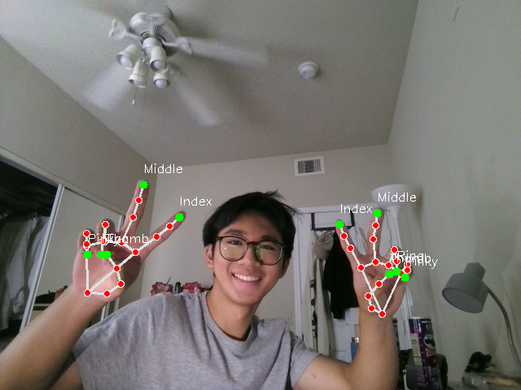
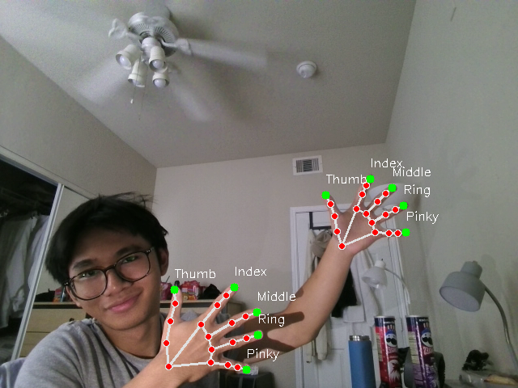
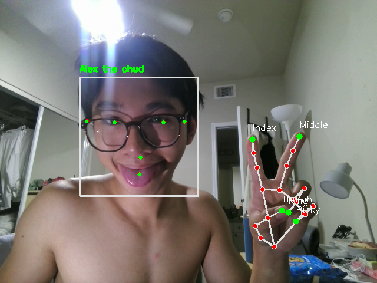

# HandTracking

Real-time hand and face tracking with [OpenCV](https://opencv.org/) and [MediaPipe](https://developers.google.com/mediapipe). It captures your webcam feed, detects up to two hands and your face at the same time, draws the hand skeleton and face mesh, and labels each finger tip (Thumb, Index, Middle, Ring, Pinky) and facial keypoint (eyes, nose, mouth, ears).

## Demo







## Features

- Live webcam capture with a mirrored (selfie) view
- Detects up to 2 hands at once via MediaPipe Hands
- Draws the full hand skeleton (landmarks + connections)
- Labels the 5 finger tips and marks them with a green dot
- Detects your face via MediaPipe Face Detection (full-range model)
- Draws a face bounding box with a label and marks the 6 facial keypoints
  (left/right eye, nose, mouth, left/right ear)
- Runs hand and face detection together on every frame
- Retries camera reads (5 attempts) so a slow camera start doesn't crash it

## Requirements

- Python 3.12
- A webcam

Dependencies are pinned in [`requirements.txt`](requirements.txt) to avoid the
numpy 2.x / mediapipe conflict.

## Setup

```bash
python -m venv venv
source venv/bin/activate
pip install -r requirements.txt
```

## Usage

```bash
python main.py
```

Press **`q`** in the video window to quit.

## How it works

1. Grab a frame from the webcam (`cv2.VideoCapture`) and flip it horizontally.
2. Convert BGR → RGB (MediaPipe expects RGB), then run both `hands.process()`
   and `face_detection.process()` on the frame.
3. For each detected face, draw the bounding box, add a label, and circle the 6
   facial keypoints.
4. For each detected hand, draw the landmarks and connections.
5. Convert the normalized finger-tip coordinates to pixels, then label and
   circle each tip.
